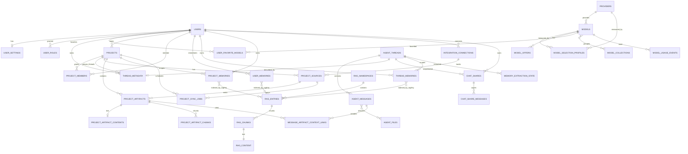
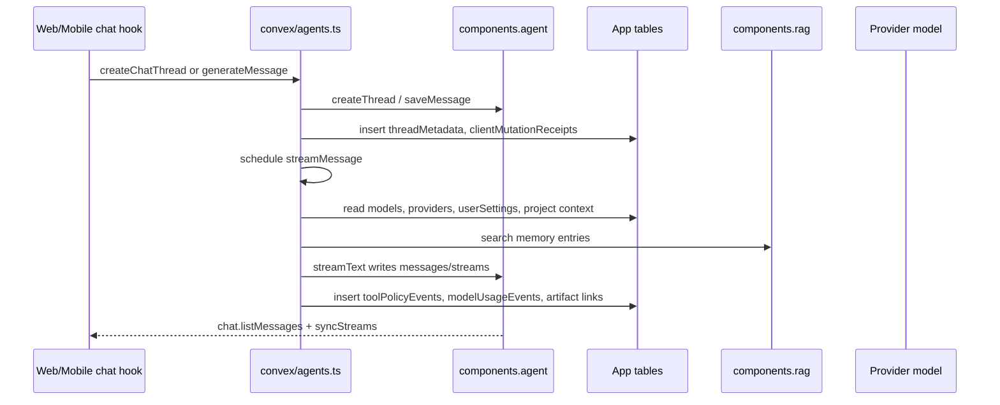
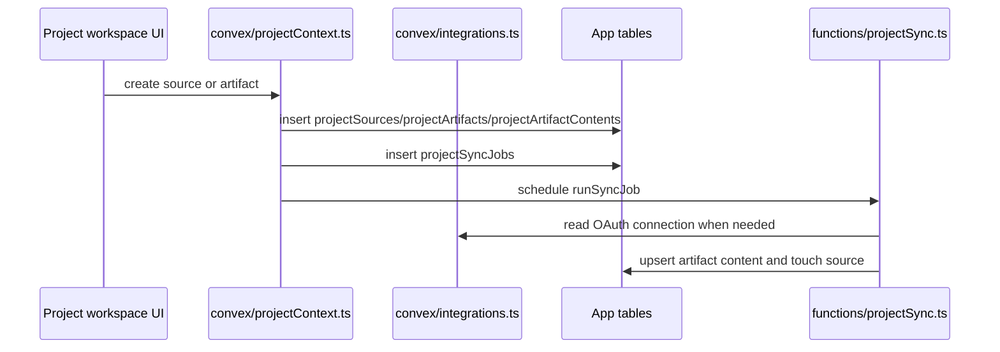
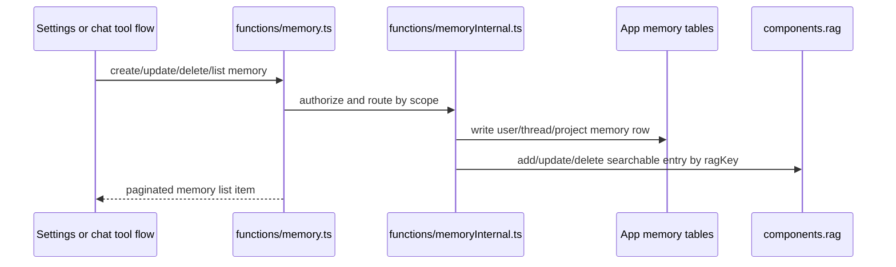

# Data Model And Table Relationships

This page documents the useful persisted data in the Convex backend, including
tables declared by this app and tables owned by installed Convex components.
The scan below follows the path from schema, to backend function, to frontend or
mobile call site. Tables with no meaningful product path are called out
separately instead of treated as first-class product data.

Source anchors:

- App schema: `packages/backend/convex/schema.ts`
- Component registration: `packages/backend/convex/convex.config.ts`
- Main chat orchestration: `packages/backend/convex/agents.ts`
- Chat reads/deletes: `packages/backend/convex/chat.ts`
- Project grouping: `packages/backend/convex/projects.ts`
- Project context/RAG sources: `packages/backend/convex/projectContext.ts`
- Memory: `packages/backend/convex/functions/memory.ts` and `functions/memoryInternal.ts`
- Admin/model catalog: `packages/backend/convex/admin.ts`, `modelRouter.ts`, and `modelSelection.ts`

## Installed Convex Components

The app registers four components:

- `components.agent` from `@convex-dev/agent`
- `components.rag` from `@convex-dev/rag`
- `components.rateLimiter` from `@convex-dev/rate-limiter`
- `components.stripe` from `@convex-dev/stripe`

These component tables are not declared in `schema.ts`, but they are live
database collections and should be part of any complete database model.

### Agent Component

Used from `agents.ts`, `chat.ts`, `shares.ts`, `projects.ts`, `sidebarSearch.ts`,
`modelRouter.ts`, and memory extraction. Product chat data is split between the
component and app-owned metadata:

- `threads`: the canonical chat thread row. Created by
  `agents.createChatThread` through `createThread(ctx, components.agent, ...)`
  and by `chat.createThread` through `components.agent.threads.createThread`.
- `messages`: canonical chat messages. `agents.generateMessage` writes prompt
  and assistant placeholders with `saveMessage`; `agents.streamMessage` writes
  streamed assistant output through `Agent.streamText`; `chat.listMessages`
  reads them for web and mobile.
- `streamingMessages` and `streamDeltas`: transient streaming state. `chat.listMessages`
  calls `syncStreams`, `agents.stopGeneration` aborts streams, and web/mobile
  optimistic stop flows mirror this query.
- `files`: attachment records keyed by storage/hash/refcount. `agents.generateMessage`
  uses `getFile`; attachment upload flows call `agents.generateAttachmentUploadUrl`.
- `memories`: component-level agent memory, currently secondary to the app's
  explicit memory/RAG system.
- vector embedding tables and `apiKeys`: component internals; useful only when
  using agent search/playground features.

Frontend/backend path:

- Web chat send path:
  `apps/web/src/hooks/chat-data/send.ts` calls `api.agents.createChatThread`,
  `generateMessage`, `regenerateMessage`, and `stopGeneration`.
- Mobile chat send path:
  `apps/mobile/src/hooks/use-send-message.ts` calls the same generation API.
- Web/mobile message reads:
  `apps/web/src/hooks/chat-data/messages.ts` and
  `apps/mobile/src/hooks/use-messages.ts` call `api.chat.listMessages`.
- Sidebar/thread reads:
  `apps/web/src/hooks/chat-data/threads.ts`,
  `apps/mobile/src/hooks/use-threads.ts`, and `packages/chat-core/src/context.tsx`
  call `api.agents.listThreadsWithMetadata`, which joins `threadMetadata` onto
  the component thread list and falls back to plain thread rows when metadata
  is stale or invalid.

### RAG Component

Used by the app memory system through `functions/memoryRag.ts` and
`functions/memoryInternal.ts`.

- `namespaces`: per-scope RAG namespace, usually derived from user, thread, or
  project scope.
- `entries`: one searchable memory entry. App tables store `ragKey` so deletes
  and updates can find the component entries.
- `chunks` and `content`: chunked searchable text for each entry.
- embedding tables: component-owned vector storage for chunk embeddings.

Frontend/backend path:

- Web settings memory panel:
  `apps/web/src/components/settings/memory-settings-panel.tsx` reads app memory
  tables through `api.functions.memory.listUserMemories`,
  `listThreadMemories`, and `listProjectMemories`.
- Mobile memory settings:
  `apps/mobile/src/app/(app)/(settings)/memory.tsx` reads the same lists.
- Chat generation:
  `agents.streamMessage` calls memory context and intent handlers, which search
  and mutate RAG entries indirectly.

### Rate Limiter Component

Used by `packages/backend/convex/lib/rateLimiter.ts` and provider/model policy
helpers.

- `rateLimits`: token/fixed-window counters by policy name, key, and shard.

This is operational support data, not user-facing product data. It is useful
because model/provider calls and plan rules can enforce limits without adding
app-owned counter tables.

### Stripe Component

Used by `packages/backend/convex/stripe.ts`, `http.ts`, `lib/billing.ts`, and
admin settings UI.

- `customers`, `subscriptions`, `checkout_sessions`, `payments`, `invoices`:
  Stripe-synchronized billing state.

Frontend/backend path:

- `apps/web/src/components/admin/admin-settings-panel.tsx` calls
  `api.stripe.createProSubscriptionCheckout` and
  `api.stripe.createBillingPortalSession`.
- `admin.getDashboardData` reads billing-derived plan/subscription state for
  operational admin pages.

## App-Owned Product Tables

### Users And Settings

Tables:

- `users`: Convex/Clerk identity record. It stores token, Clerk id, contact
  fields, display basics, anonymity, and `appPlan`.
- `userSettings`: profile and preference record for display name/image/bio,
  reasoning defaults, voice transcription mode, auxiliary model, and routing
  preference.
- `admins` and `userRoles`: admin authorization and role context.

Main backend functions:

- `users.ensureCurrentUser`, `viewer`, `getProfile`, `getOrCreateProfile`
- `users.getSettings`, `updateSettings`
- `admin.isAdmin`, `getRoleContext`, `listAdminAccounts`, `setUserAppPlan`,
  `makeAdmin`, `setUserRole`

Frontend/backend path:

- Web auth/admin shell calls `users.ensureCurrentUser`, `admin.isAdmin`, and
  `admin.getDashboardData`.
- Web/mobile chat session hooks call `users.viewer`.
- Web and mobile settings call `users.getSettings` and `users.updateSettings`.
- Admin accounts UI calls `admin.listAdminAccounts` and `admin.setUserAppPlan`.

Relationships:

- `users._id` is referenced by most app-owned tables as `userId`,
  `ownerUserId`, `createdByUserId`, `grantedBy`, or `invitedByUserId`.
- `userSettings.userId`, `admins.userId`, and `userRoles.userId` are one-to-one
  or one-to-many extensions of `users`.

### Model Catalog, Admin, Routing, And Billing

Tables:

- `providers`: admin-managed provider credentials, API base URL, icons,
  enablement, discovery state, and rate limits.
- `models`: admin-managed model catalog. Each row belongs to a provider.
- `modelCollections`: ordered UI collections of models.
- `modelOffers`: temporary free-access or availability-window offers for a model.
- `userFavoriteModels`: per-user favorite models.
- `adminSettings`: global app plan and routing settings.
- `modelSelectionProfiles`: model/provider metrics used by automatic model
  selection.
- `modelRoutingPolicies`: policy constraints for the model selection mutation.
- `routerEvents`: audited decisions produced by `modelSelection.selectModel`
  and normalized successful Python Auto decisions.
- `trainingExamples`: supervised feedback examples from routing outcomes.
- `autoModelDecisions`: audited decisions produced by `modelRouter.selectAutoModel`.
- `modelUsageEvents`: usage/cost telemetry recorded after generation.

Main backend functions:

- Admin catalog:
  `admin.listModelsForBrowser`, `getModelBrowserMetadata`,
  `listAdminModels`, `addModel`, `updateModel`, `deleteModel`,
  `listAdminProviders`, `addProvider`, `updateProvider`, `deleteProvider`,
  `listAdminCollections`, `addModelCollection`, `updateModelCollection`,
  `listModelOffers`, `createModelOffer`, `updateModelOffer`, `deleteModelOffer`
- Model selection:
  `modelRouter.selectAutoModel`, `selectAutoModelForPromptMessage`,
  `modelSelection.selectModel`, `reportOutcome`
- Usage:
  `agents.streamMessage` calls `internal.admin.recordModelUsage` and reports
  Auto-routed stream outcomes through `modelSelection.reportOutcome`

Frontend/backend path:

- Web and mobile model pickers call `admin.getModelBrowserMetadata`,
  `admin.listModelsForBrowser`, and `admin.setFavoriteModel`.
- Web admin pages call provider/model/collection/offer/settings functions.
- Web/mobile send flows call `modelRouter.selectAutoModel` before generation
  when auto model mode is selected.

Relationships:

- `models.providerId -> providers._id`
- `modelSelectionProfiles.modelId -> models._id`
- `modelSelectionProfiles.providerId -> providers._id`
- `modelRoutingPolicies.allowedModelIds[]` and `fallbackModelIds[] -> models._id`
- `modelCollections.modelIds[] -> models._id`
- `modelOffers.modelId -> models._id`
- `userFavoriteModels.userId -> users._id`
- `userFavoriteModels.modelId -> models._id`
- `modelUsageEvents.userId -> users._id`
- `modelUsageEvents.providerId -> providers._id`
- `modelUsageEvents.modelId -> models._id`
- `routerEvents.selectedModelId/finalModelId/candidateModelIds[]/fallbackModelIds[] -> models._id`
- `routerEvents.selectedProviderId -> providers._id`

### Chat, Thread Metadata, Shares, And Attachments

Tables:

- Component `agent.threads`: canonical thread record.
- Component `agent.messages`: canonical chat message record.
- Component `agent.streamingMessages` and `agent.streamDeltas`: live stream state.
- Component `agent.files`: uploaded attachment metadata.
- `threadMetadata`: app-owned presentation and grouping for component threads.
  Stores emoji/icon, section, project, owner, client idempotency key, pin sort,
  and last message timestamp.
- `clientMutationReceipts`: idempotency receipts for generate/regenerate calls.
- `toolPolicyEvents`: trace of memory/tool-policy checks during generation.
- `chatShares`: public share snapshot header for a thread.
- `chatShareMessages`: immutable copied messages for a public share.
- `messageArtifactContextLinks`: links a prompt message to project artifacts
  inserted into generation context.

Main backend functions:

- `agents.createChatThread`: creates component thread and `threadMetadata`.
- `agents.generateMessage`: saves prompt and assistant placeholder messages,
  writes receipts, links project artifacts, updates `threadMetadata.lastMessageAt`,
  then schedules `agents.streamMessage`.
- `agents.streamMessage`: resolves provider/model, memory and project context,
  evaluates tool policy, streams into agent component messages/streams, and
  records model usage.
- `agents.regenerateMessage`: deletes downstream component messages and
  schedules a new stream.
- `agents.stopGeneration`: aborts component stream state.
- `chat.listMessages`, `chat.getThread`, `chat.deleteThread`
- `shares.createOrUpdateChatShare`, `getChatShare`, `listChatShareMessages`

Frontend/backend path:

- Web chat hooks call `createChatThread`, `generateMessage`,
  `regenerateMessage`, `stopGeneration`, `chat.listMessages`, `chat.getThread`,
  and `agents.listThreadsWithMetadata`.
- Mobile chat hooks call the same core APIs.
- Web and mobile share UI call `shares.createOrUpdateChatShare`.
- Public web share route calls `shares.getChatShare` and
  `shares.listChatShareMessages`.
- Sidebar search calls `sidebarSearch.searchSidebar`, which searches component
  messages and enriches results with `threadMetadata` and `projects`.

Relationships:

- `threadMetadata.threadId -> components.agent.threads._id` as a string.
- `clientMutationReceipts.threadId -> components.agent.threads._id` as a string.
- `toolPolicyEvents.threadId -> components.agent.threads._id` as a string.
- `chatShares.threadId -> components.agent.threads._id` as a string.
- `chatShareMessages.shareId -> chatShares._id`
- `messageArtifactContextLinks.artifactId -> projectArtifacts._id`
- `messageArtifactContextLinks.threadId/messageId` reference component agent
  thread/message ids as strings.
- `agent.messages.fileIds[] -> components.agent.files._id`

### Projects, Membership, Integrations, And Project Context

Tables:

- `projects`: user-owned/shared project workspace for grouping threads and
  attaching context.
- `projectMembers`: explicit membership and role rows.
- `threadMetadata.projectId`: the current thread-to-project assignment.
- `integrationConnections`: OAuth connection records for GitHub/Gmail.
- `oauthStates`: short-lived OAuth PKCE/state records.
- `projectSources`: configured project context source, such as GitHub repo,
  Gmail query, manual uploads, or manual links.
- `projectArtifacts`: item discovered or manually added from a source.
- `projectArtifactContents`: extracted searchable text for an artifact.
- `projectArtifactChunks`: schema-defined vector chunks for artifact retrieval.
- `projectSyncJobs`: queued/running/done/error source sync jobs.
- `messageArtifactContextLinks`: prompt-to-artifact context provenance.

Main backend functions:

- Project grouping:
  `projects.createProject`, `listProjects`, `updateProject`, `deleteProject`,
  `assignThreadToProject`, `removeThreadFromProject`, `getProjectForThread`,
  `listThreadsByProject`, `suggestProjectFromContext`
- Membership:
  `projectMembers.listProjectMembers`, `addProjectMember`,
  `updateProjectMemberRole`, `removeProjectMember`
- Project context UI:
  `projectContext.getProjectWorkspace`, `listProjectSources`,
  `createGithubRepoSource`, `createGmailQuerySource`,
  `createManualLinkArtifact`, `generateProjectUploadUrl`,
  `createUploadedArtifact`, `listProjectArtifacts`,
  `updateProjectArtifact`, `syncProjectSourceNow`
- Integrations:
  `integrations.listConnections`, `getOAuthStartUrl`,
  `disconnectConnection`, `validateConnection`
- Generation context:
  `functions.projectRetrieval.buildPromptProjectContext` is called by
  `agents.streamMessage`.

Frontend/backend path:

- Web/mobile core project lists and assignment flow use `api.projects.*`.
- Web project workspace route calls `api.projectContext.*` and
  `api.integrations.*`.
- The same web project workspace reads `projectMembers.listProjectMembers`;
  member mutations are backend-ready but have no current scoped UI call site.
- Mobile attachment/project picker calls `projects.getProjectForThread` and
  `projects.removeThreadFromProject`.
- Chat composer project context calls `projects.suggestProjectFromContext`.

Relationships:

- `projects.ownerUserId -> users._id`
- `projectMembers.projectId -> projects._id`
- `projectMembers.userId -> users._id`
- `threadMetadata.projectId -> projects._id`
- `integrationConnections.ownerUserId -> users._id`
- `oauthStates.userId -> users._id`
- `projectSources.projectId -> projects._id`
- `projectSources.createdByUserId -> users._id`
- `projectSources.connectionId -> integrationConnections._id`
- `projectArtifacts.projectId -> projects._id`
- `projectArtifacts.sourceId -> projectSources._id`
- `projectArtifacts.createdByUserId -> users._id`
- `projectArtifacts.parentArtifactId -> projectArtifacts._id`
- `projectArtifactContents.artifactId -> projectArtifacts._id`
- `projectArtifactChunks.artifactId -> projectArtifacts._id`
- `projectSyncJobs.projectId -> projects._id`
- `projectSyncJobs.sourceId -> projectSources._id`

Note: `projectArtifactChunks` has a schema and vector index, but the current
retrieval path reads `projectArtifacts` and `projectArtifactContents`. Treat
`projectArtifactChunks` as planned or partially wired until sync/retrieval code
starts writing it.

### Memory

Tables:

- `userMemories`: durable user-level preferences/facts.
- `threadMemories`: thread-scoped memories.
- `projectMemories`: project-scoped memories.
- `memoryExtractionState`: per-thread extraction cursor and status.
- `memoryState`: per-user sync status.
- `memoryFiles`, `memoryChunks`, `memoryEmbeddingCache`, `memoryMeta`,
  `memorySyncState`: older file/session memory sync and embedding cache tables.

Main backend functions:

- User-facing memory:
  `functions.memory.createUserMemory`, `createThreadMemory`,
  `createProjectMemory`, `listUserMemories`, `listThreadMemories`,
  `listProjectMemories`, `updateMemory`, `deleteMemory`, `searchMemory`
- Internal write path:
  `functions.memoryInternal.createMemoryInScope`, `updateMemoryInScope`,
  `deleteMemoryInScope`
- Extraction:
  `functions.memoryExtraction.extractMemoriesFromThread`, called from
  generation workflows
- RAG component:
  `memoryInternal` adds, updates, and deletes `components.rag.entries` by
  `ragKey`.

Frontend/backend path:

- Web and mobile memory settings list user/thread/project memories.
- Generation searches memory context automatically through `agents.streamMessage`.
- Memory intent handlers can create/update/delete memory from chat tool policy
  flows.

Relationships:

- `userMemories.userId -> users._id`
- `threadMemories.userId -> users._id`
- `threadMemories.threadId -> components.agent.threads._id` as a string
- `projectMemories.userId -> users._id`
- `projectMemories.projectId -> projects._id`
- `memoryExtractionState.threadId -> components.agent.threads._id` as a string
- `memoryExtractionState.userId -> users._id`
- each memory row's `ragKey` maps to one or more `components.rag.entries`

The older file/session memory tables are useful for `functions/memorySync.ts`,
`functions/memorySearch.ts`, and `apps/web/src/routes/memory-demo.tsx`, but they
are not part of the primary chat memory settings flow.

## Function-To-UI Matrix

| Backend module | Main tables/components | Frontend/mobile path |
| --- | --- | --- |
| `agents.ts` | `threadMetadata`, `clientMutationReceipts`, `toolPolicyEvents`, `models`, `providers`, `userSettings`, `modelUsageEvents`, `messageArtifactContextLinks`, `components.agent.*` | Web/mobile send hooks, thread hooks, context meter, attachment upload |
| `chat.ts` | `components.agent.threads`, `components.agent.messages`, `components.agent.streams`, `threadMetadata`, `projects`, `projectMembers` | Web/mobile message lists, thread header, delete thread |
| `projects.ts` | `projects`, `projectMembers`, `threadMetadata`, `projectMemories`, `components.agent.*` | Web/mobile sidebar project lists, assignment, project picker, project suggestion |
| `projectContext.ts` | `projectSources`, `projectArtifacts`, `projectArtifactContents`, `projectSyncJobs`, `integrationConnections`, `threadMetadata`, `projectMembers` | Web project workspace |
| `integrations.ts` | `integrationConnections`, `oauthStates` | Web project workspace OAuth/connect flow |
| `projectMembers.ts` | `projectMembers`, `projects` | Web project workspace reads members; mutations currently have no scoped UI caller |
| `shares.ts` | `chatShares`, `chatShareMessages`, `components.agent.messages` | Web/mobile share dialogs and public share route |
| `users.ts` | `users`, `userSettings` | Web/mobile auth/session/profile/settings hooks |
| `admin.ts` | `providers`, `models`, `modelCollections`, `modelOffers`, `userFavoriteModels`, `adminSettings`, `modelUsageEvents`, `autoModelDecisions`, `modelSelectionProfiles`, `admins`, `userRoles` | Web admin panels, web/mobile model picker, favorites |
| `modelRouter.ts` | `adminSettings`, `userSettings`, `models`, `providers`, `modelSelectionProfiles`, `autoModelDecisions`, `components.agent.messages` | Web/mobile auto-model send path |
| `modelSelection.ts` | `modelSelectionProfiles`, `modelRoutingPolicies`, `routerEvents`, `trainingExamples`, `models`, `providers` | HTTP/workflow route in `http.ts`; no scoped React call site found |
| `functions/memory.ts` | `userMemories`, `threadMemories`, `projectMemories`, `projects`, `components.rag`, `components.agent.threads` | Web/mobile memory settings list; generation/tool flows use create/update/delete indirectly |
| `functions/projectRetrieval.ts` | `projectArtifacts`, `projectArtifactContents`, `projectMembers` | Chat generation and project tools; no direct scoped UI caller found |
| `sidebarSearch.ts` | `components.agent.messages`, `threadMetadata`, `projects` | Web/mobile sidebar search |
| `sections.ts` | `sections` | No current scoped frontend caller found |
| `messages.ts` | app-owned legacy `messages` | No current scoped frontend caller found |

## Tables With Weak Or No Product Path

These tables exist in the schema but should not be promoted as core product
tables unless their usage is expanded:

- `messages`: legacy/simple message table used only by
  `packages/backend/convex/messages.ts`. Current chat uses
  `components.agent.messages`; no web/mobile call sites reference `api.messages`.
- `sections`: CRUD exists in `packages/backend/convex/sections.ts`, and
  `threadMetadata.sectionId` can point to it, but no current web/mobile call
  sites use `api.sections` or `agents.updateThreadSection`.
- `projectArtifactChunks`: vector schema exists, but current project retrieval
  reads `projectArtifactContents`; no current writer was found in app code.
- `memoryMeta`: schema exists, but no current scoped source read/write path was
  found.
- `memoryState`: schema exists as per-user sync state, but the primary memory
  settings and generation paths use `userMemories`, `threadMemories`,
  `projectMemories`, `memoryExtractionState`, and the RAG component.
- `trainingExamples`: backend-only model selection training data. Useful for
  routing development, not currently surfaced in the frontend.
- `routerEvents`, `trainingExamples`, and `modelRoutingPolicies`: useful through
  `modelSelection.ts` and the HTTP workflow in `http.ts`, but the main
  web/mobile send flow currently calls `modelRouter.selectAutoModel`, which
  writes `autoModelDecisions`.
- component `agent.memories` and `agent.apiKeys`: installed component internals,
  not the app's primary memory system.

## UML / ER Diagram

## Main Data Flows

### Send A New Message

### Create Or Attach Project Context

### Memory Lifecycle

