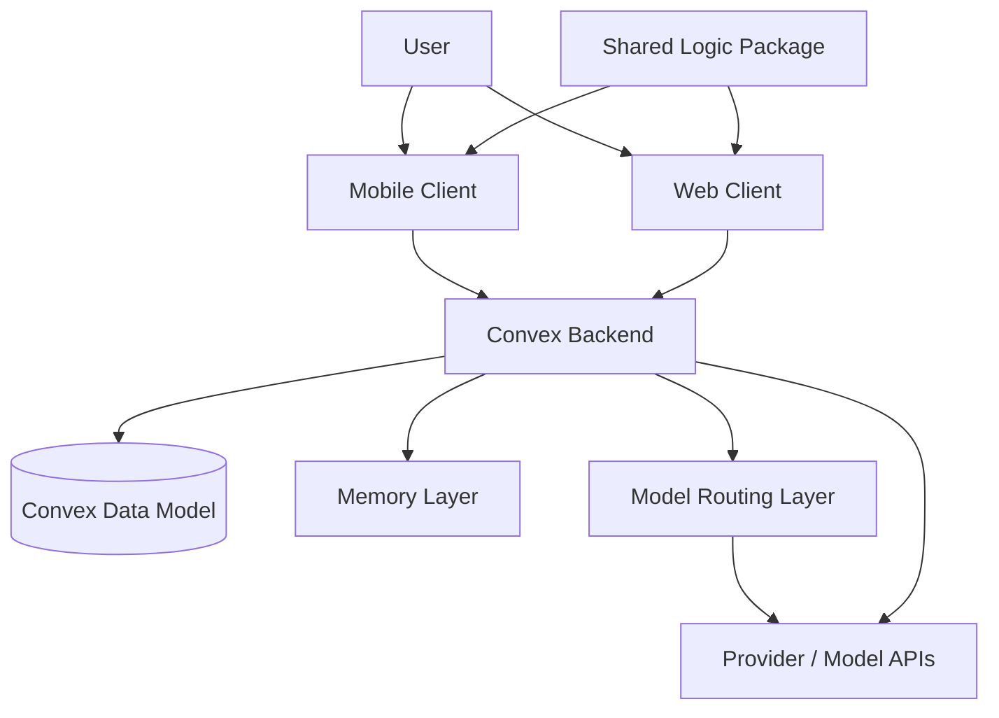
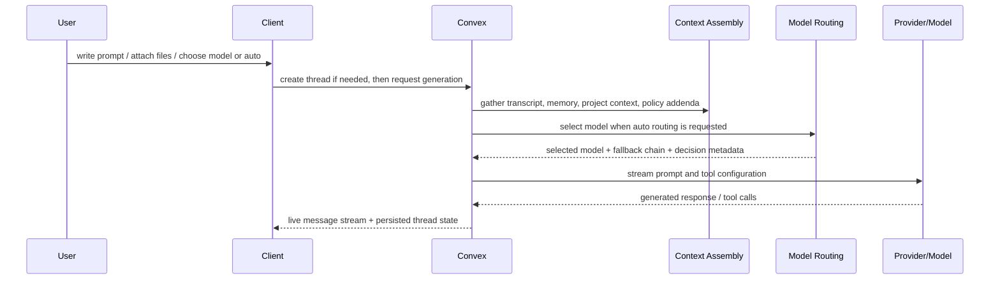

# System Thesis

Research set: [Overview](./README.md) | [Next: Context Assembly](./02-context-assembly.md)

**Thesis:** this app treats AI chat as a systems problem, not a single-model interface problem.

Why this matters: many chat products appear simple at the surface and become inconsistent underneath. Memory, routing, offline continuity, and UX fallbacks get mixed together until the system cannot explain its own behavior. This repo takes the opposite stance. It separates the concerns that need to stay separate and makes them cooperate through explicit boundaries.

## Problem Framing

A multi-model chat app that aims to feel dependable has to solve more than text generation:

- It needs a durable system of record for users, threads, projects, model availability, and memory.
- It needs a way to build prompt context from more than the last message.
- It needs to choose among models without hardwiring one provider into the UI.
- It needs continuity when the network is slow, absent, or partially failing.
- It needs user experience rules that make failure visible without making the interface brittle.

The architectural thesis of this repository is that these problems should be treated as separate layers.

## Core Design Values

- `Explicit state over hidden state`: persisted product data lives in Convex, not inside client-only heuristics.
- `Layered memory over magical memory`: durable memories are retrieved and injected as context, not assumed to be "inside the model."
- `Routing as control plane`: model choice is governed by configuration, profiles, policies, and recorded decisions.
- `Continuity over perfect symmetry`: mobile and web do not have identical offline guarantees, but each is designed to preserve user continuity in a platform-appropriate way.
- `Composable UX over monolith screens`: the mobile chat UI in particular is structured around reusable chat components rather than route-owned screen logic.

## System Topology

This topology shows a deliberate center of gravity. The clients are important, but they are not the source of truth. They specialize in interaction, local continuity, and presentation. Convex owns orchestration, persistence, and backend policy. Memory and routing are distinct backend domains layered onto chat rather than buried inside the UI.

## Request Path

Two choices matter here. First, prompt context is assembled before generation rather than assumed to emerge from raw conversation history. Second, routing is a separable step with its own inputs and outputs, not a hidden `if provider == ...` branch inside a client component.

## Architectural Boundaries

The main boundaries in the repo align with the thesis:

- `apps/mobile` and `apps/web` are user-facing clients with different interaction and offline strategies.
- `packages/shared` is intentionally narrow and holds cross-platform logic rather than full screen composition.
- `convex/schema.ts` is the persisted product model: users, models, routing policy, projects, shares, memories, and related records.
- `convex/agents.ts` is the orchestration layer where chat generation, context assembly, tool policy, and streaming meet.
- The memory subsystem is primarily represented by `convex/functions/memory*.ts`.
- The routing subsystem is primarily represented by `convex/modelSelection.ts`.

The result is not a microservices diagram. It is a layered monorepo with a strong backend center and deliberately thin client orchestration.

## Related Patterns / Influences

- Stateful assistant systems that distinguish conversation state from product state.
- Local-first application design, but applied selectively rather than as a universal invariant.
- Control-plane/data-plane thinking, where model choice is configured and observed separately from model execution.

## Tradeoffs and Limits

- Convex becomes the architectural center, which simplifies consistency but concentrates responsibility in one backend domain.
- The clients are not fully interchangeable: mobile has a richer local-first path than web.
- The shared package stays small on purpose, which avoids accidental coupling but limits how much UI logic can be unified.
- Memory and routing are explicit layers, but that also means more moving parts to reason about than in a single-model stateless chat app.

## Implementation Anchors

- Data model: [`convex/schema.ts`](../../convex/schema.ts)
- Chat orchestration: [`convex/agents.ts`](../../convex/agents.ts)
- Mobile client boundary: [`apps/mobile`](../../apps/mobile)
- Web client boundary: [`apps/web`](../../apps/web)
- Cross-platform helpers: [`packages/shared`](../../packages/shared)

## Open Questions / Next Directions

- Should the web client eventually adopt the same local thread handoff model used on mobile?
- How far should routing and memory remain separate layers before a tighter coordination layer becomes useful?
- Can the narrow shared package stay narrow as project-context and memory flows become richer across clients?
