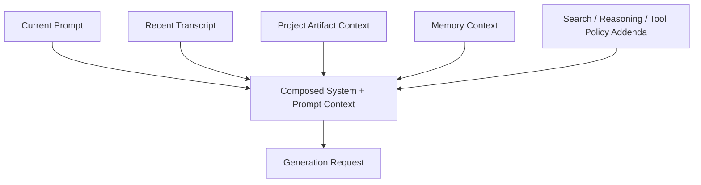
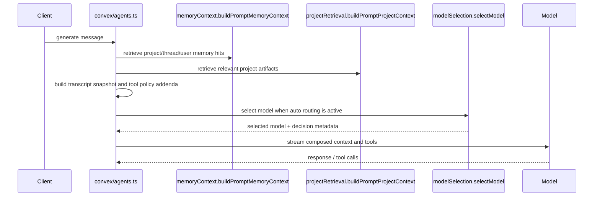

# Context Assembly

Research set: [Overview](./README.md) | [Previous: System Thesis](./01-system-thesis.md) | [Next: Memory System](./03-memory-system.md)

**Thesis:** the app does not send a bare user message to a model; it assembles context from multiple bounded sources before generation begins.

Why this matters: in AI chat, "context" is often treated as a vague idea. In practice, the difference between a dependable system and a confusing one is whether context comes from explicit layers with clear precedence rules. This repository makes that assembly step visible in backend orchestration rather than hiding it in prompt templates or client heuristics.

## Context Layers

The generation path in `convex/agents.ts` combines several context sources:

| Layer                    | Role                                                                     | Durability   |
| ------------------------ | ------------------------------------------------------------------------ | ------------ |
| Current user prompt      | The newest request and the strongest signal                              | transient    |
| Recent thread transcript | Immediate conversational continuity                                      | transient    |
| Project artifact context | Retrieved documents and snippets tied to the current project             | semi-durable |
| Memory context           | Retrieved user/thread/project memories                                   | durable      |
| System addenda           | Search rules, memory tool rules, reasoning flags, thread-metadata policy | procedural   |

These layers are assembled as text and instructions before streaming starts. The system therefore distinguishes between "what the user just said," "what this conversation already contains," and "what the product deliberately remembers or retrieves."

## Prompt Assembly Model

The important point is not that there are many inputs. It is that each input has a different job. Project artifacts provide relevant external knowledge for a linked project. Memory provides durable facts selected by scope. Policy addenda constrain how tools and thread metadata should behave. These are related, but they are not interchangeable.

## Sequence of Assembly

This is a concrete systems choice. Context assembly happens server-side, close to the system of record, not in a client-only preprocessor.

## Precedence Rules

Several precedence rules are already visible in code:

- The latest user message overrides memory. `convex/agents.ts` explicitly tells the model that stored memory is advisory.
- Project memory outranks thread memory, which outranks user memory, when deduplicating by `contentHash`. `memoryContext.ts` passes the groups to `dedupeMemoryHitsByPriority` in that order.
- Explicitly selected project artifacts outrank ordinary matches in `projectRetrieval.ts` by receiving a much higher search score.
- If no project is linked, the project-context layer does not silently vanish; it emits a clear "no project" result.
- If the prompt is empty, memory context returns an empty result rather than manufacturing retrieval.

These rules matter because they reduce ambiguity. The model is not asked to infer which source is authoritative; the system frames that authority before generation.

## Failure Behavior

The context system is designed to fail by omission rather than invention:

- Missing project linkage yields an explicit empty project-context response.
- Missing artifact matches yields "no relevant project artifacts were found" rather than stale fallback text.
- Missing memory hits yields labeled sections with no entries rather than fabricated summaries.
- Offline failure is handled on the client before generation begins; both clients can refuse send with an `offline` disabled reason.

That last point is easy to miss. Offline is not treated as a weird model error. It is a client-state condition that blocks prompt assembly from starting.

## Why Context Assembly Is Separate From Memory

Memory is only one contributor to prompt context. That distinction keeps the system honest:

- A recent transcript is not the same as a durable memory.
- A project artifact is not the same as a user preference.
- A search requirement is not a knowledge source; it is a behavioral constraint.

By keeping these layers separate, the system can add or remove one layer without redefining the whole app. This makes it easier to evolve routing, memory, or project context independently.

## Tradeoffs and Limits

- The assembled system prompt is more explicit, but it is also more complex than a minimal chat wrapper.
- Context is mostly textual; the design favors clarity and compatibility over a more structured intermediate representation.
- Memory retrieval depends on supporting backend infrastructure and is not free to compute.
- Because context layers are additive, poor ranking in one layer can still create noise even when the boundaries are clear.

## Implementation Anchors

- Orchestration and final prompt assembly: [`convex/agents.ts`](../../convex/agents.ts)
- Memory retrieval for prompt context: [`convex/functions/memoryContext.ts`](../../convex/functions/memoryContext.ts)
- Project artifact retrieval: [`convex/functions/projectRetrieval.ts`](../../convex/functions/projectRetrieval.ts)

## Open Questions / Next Directions

- Would a structured context object be more robust than the current text-first composition model?
- Should context layers expose richer observability to the user, for example "which memories were used" during a response?
- How should project context evolve if artifact retrieval becomes more semantic and less keyword-weighted over time?
