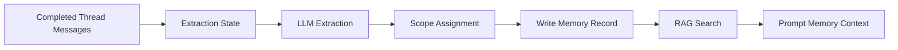
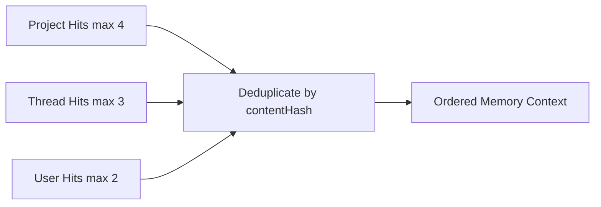

# Memory System

Research set: [Overview](./README.md) | [Previous: Context Assembly](./02-context-assembly.md) | [Next: Local-First](./04-local-first.md)

**Thesis:** memory in this app is a layered retrieval system with scoped persistence, not a vague promise that the model "just remembers."

Why this matters: memory is one of the most overloaded terms in AI product design. A credible memory system has to answer concrete questions. What gets stored? At what scope? When is it retrieved? What wins when memories conflict? This repository answers those questions with explicit tables, extraction flows, and prompt-time retrieval rules.

## Scope Model

The system stores durable memories at three semantic scopes:

| Scope   | Intended use                                              | Primary table     |
| ------- | --------------------------------------------------------- | ----------------- |
| User    | stable preferences, profile facts, long-term user context | `userMemories`    |
| Thread  | details that matter mainly to one conversation            | `threadMemories`  |
| Project | facts that belong to a project linked to the thread       | `projectMemories` |

These user-visible memory records are supported by additional backend state such as `memoryFiles`, `memoryChunks`, `memoryEmbeddingCache`, `memoryState`, and `memoryExtractionState`. The point is not to expose every support table to the user. The point is that "memory" is backed by real storage and retrieval machinery.

## Memory Lifecycle

The extraction path in `memoryExtraction.ts` reads successful thread messages that have not yet been processed, builds a transcript, and asks a model to return only stable, long-term memories. It rejects transient details and enforces scope-specific rules. In particular, project-scoped memory is only created if a project is actually linked to the thread.

## How Memories Are Produced

The extraction pipeline already encodes several important ideas:

- Extraction is incremental. The system tracks `lastProcessedOrder` per thread in `memoryExtractionState`.
- The extraction prompt explicitly asks for stable facts and discourages short-lived status updates.
- Scope is part of extraction output, not an afterthought.
- Project scope is conditional; if the thread has no linked project, project memory candidates are skipped.
- Rate-limit problems do not silently disappear. Extraction state can record error or retry-oriented status.

This means memory creation is not just a "save summary" button. It is an ongoing backend process that mines durable facts from completed conversation state.

## How Memories Are Retrieved

At prompt time, `memoryContext.ts` retrieves hits separately for project, thread, and user scopes. It currently uses explicit limits:

- up to 4 project hits
- up to 3 thread hits
- up to 2 user hits

The raw hits are then deduplicated by `contentHash` in priority order.

The order matters. Project memory is treated as highest priority, then thread, then user. A duplicated fact should remain closest to the current task context instead of appearing multiple times at lower scopes.

## Memory As A Separate Layer

One of the strongest design choices in this repo is that memory remains outside the core chat UI composition layer.

- The chat UI is responsible for rendering conversation and local interaction.
- Memory logic lives in backend functions that create, update, search, and retrieve memory.
- The model can be guided to use memory tools explicitly, but those tools are governed by policy and scope rules.
- The web app exposes memory management surfaces, but memory itself is not stored as a UI-only concept.

This separation is important for research credibility. It makes memory inspectable and governable as product state rather than as a prompt trick.

## Limits Of The Memory Layer

The system is careful, but it is not magical:

- Extracted memory is advisory. The latest user message is allowed to override it.
- Scope assignment can still be imperfect because extraction depends on model judgment.
- Not every useful piece of context should become memory. Some context should stay transient in the current thread or project retrieval layer.
- Retrieval quality depends on ranking and embedding quality, not only on raw storage.

In other words, the design treats memory as a bounded assistant to conversation, not as an infallible autobiographical record.

## Related Patterns / Influences

- Personal knowledge systems that separate long-term memory from working memory.
- Retrieval-augmented generation, adapted here for product memory scopes rather than only external documents.

## Tradeoffs and Limits

- The memory subsystem adds real complexity: extraction, indexing, retrieval, and scope-aware CRUD all need to stay coherent.
- Because extraction is model-mediated, memory quality is partly a prompt and model-quality question.
- The current design prioritizes clarity and inspectability over extreme automation.
- Prompt-time retrieval keeps memory explicit, but it also means memory is only as useful as the retrieval step that surfaces it.

## Implementation Anchors

- Memory CRUD and listing surfaces: [`convex/functions/memory.ts`](../../convex/functions/memory.ts)
- Incremental extraction path: [`convex/functions/memoryExtraction.ts`](../../convex/functions/memoryExtraction.ts)
- Prompt-time retrieval and deduplication: [`convex/functions/memoryContext.ts`](../../convex/functions/memoryContext.ts)
- Memory tables and support state: [`convex/schema.ts`](../../convex/schema.ts)

## Open Questions / Next Directions

- Should the system make memory confidence or provenance more visible to users?
- When should extraction move from incremental thread mining to richer project-aware summarization?
- Could memory ranking incorporate stronger recency, trust, or user-confirmation signals without making the layer opaque?
