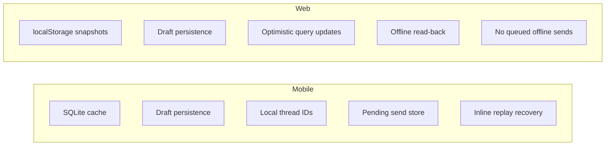
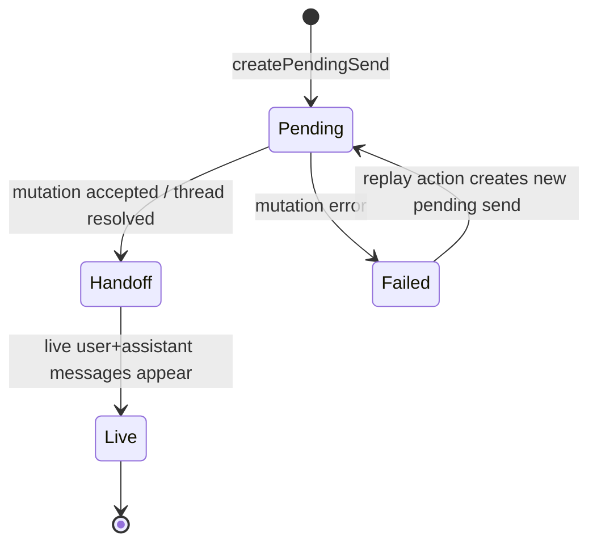

# Local-First

Research set: [Overview](./README.md) | [Previous: Memory System](./03-memory-system.md) | [Next: Model Routing](./05-model-routing.md)

**Thesis:** local-first in this app is a continuity strategy, not a claim that every client offers identical offline semantics.

Why this matters: "offline support" is often described as a binary feature. In practice, different platforms benefit from different local guarantees. This repository makes that asymmetry explicit. Mobile aims for stronger continuity through local state and optimistic handoff. Web emphasizes read-back, optimistic UI, and last-known-state caching without promising queued offline mutation parity.

## Two Local-First Profiles

The point of this comparison is not that one client is "better." It is that the product expresses local-first differently on each platform.

## Mobile Path

Mobile has the stronger local-first implementation:

- `apps/mobile/src/offline/cache.ts` stores session, threads, messages, models, projects, settings, and drafts in SQLite-backed storage.
- `apps/mobile/src/mobile-data/use-send-message.ts` can create local thread IDs before a server thread exists.
- `apps/mobile/src/store/chat-optimistic-send.ts` keeps pending, handoff, and failed send state outside the network round trip.
- When a server thread resolves, the optimistic store can move pending records from the local thread key to the real thread ID.
- Failed sends remain visible as failed assistant responses with inline error text and replay actions.

This is local-first in the operational sense: the user can begin a conversation, see it rendered locally, and recover from failure without losing the interaction state that mattered.

## Web Path

The web app chooses a lighter local-first model:

- `apps/web/src/offline/local-cache.ts` stores session and user-scoped snapshots in `localStorage`.
- `apps/web/src/hooks/chat-data/send.ts` performs optimistic thread and message insertion using the Convex local query store.
- Successful live data is mirrored into local browser cache for read-back.
- Draft state persists locally, so navigation and refresh are less destructive.
- If the client is offline, send and regenerate paths return `disabledReason: 'offline'` rather than pretending a queued mutation exists.

This makes web resilient for browsing and continuity, but intentionally more conservative for write behavior.

## Operational Comparison

| Capability                      | Mobile                                 | Web                            |
| ------------------------------- | -------------------------------------- | ------------------------------ |
| Offline read-back               | strong                                 | moderate                       |
| Draft persistence               | yes                                    | yes                            |
| Optimistic thread creation      | yes, with local IDs                    | yes, with optimistic rows      |
| Pending send recovery           | explicit local store                   | mostly query-store optimism    |
| Retry after failure             | inline replay from failed response     | retry through normal send flow |
| Offline queued mutation promise | no full queue, but stronger continuity | intentionally not promised     |

The table shows that the system is not purely "offline-first." Instead, it is locally resilient where that resilience has the highest UX value.

## Optimistic Send State

The mobile optimistic-send state machine is especially revealing. It does not treat optimism as a visual flourish. It tracks the lifecycle of a send, including the gap between "local intent exists" and "server-backed thread and messages exist."

## Why The Asymmetry Is Intentional

There are good reasons for the platform split:

- Mobile usage benefits more from intermittent-network continuity and app-resume behavior.
- SQLite-backed local data gives the native client a stronger storage base than the web client's browser cache.
- The cost of pretending to support full offline mutations on web can exceed the UX value when conflict handling is weak.
- Last-known-state read-back is still valuable on web even when queued writes are not.

This is a pragmatic interpretation of local-first. The product preserves continuity without overpromising symmetry.

## Tradeoffs and Limits

- Mobile local continuity is stronger, but it also requires more local state management complexity.
- Web behavior is simpler to reason about, but less ambitious for offline write continuity.
- Both clients still depend on Convex as the source of truth for persisted product state.
- Optimistic rendering improves responsiveness, but it creates more edge cases around failure, rollback, and handoff correctness.

## Implementation Anchors

- Mobile offline cache: [`apps/mobile/src/offline/cache.ts`](../../apps/mobile/src/offline/cache.ts)
- Mobile optimistic send state: [`apps/mobile/src/store/chat-optimistic-send.ts`](../../apps/mobile/src/store/chat-optimistic-send.ts)
- Mobile send flow: [`apps/mobile/src/mobile-data/use-send-message.ts`](../../apps/mobile/src/mobile-data/use-send-message.ts)
- Web offline cache: [`apps/web/src/offline/local-cache.ts`](../../apps/web/src/offline/local-cache.ts)
- Web send flow: [`apps/web/src/hooks/chat-data/send.ts`](../../apps/web/src/hooks/chat-data/send.ts)

## Open Questions / Next Directions

- Should the web client adopt a first-class pending-send store similar to mobile, or is its lighter model a better long-term tradeoff?
- At what point would a real offline mutation queue become worth the added conflict-resolution complexity?
- How should local-first behavior change if project artifact context becomes more central to day-to-day usage?
