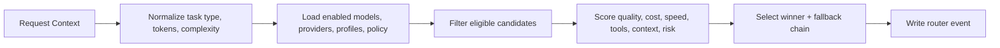
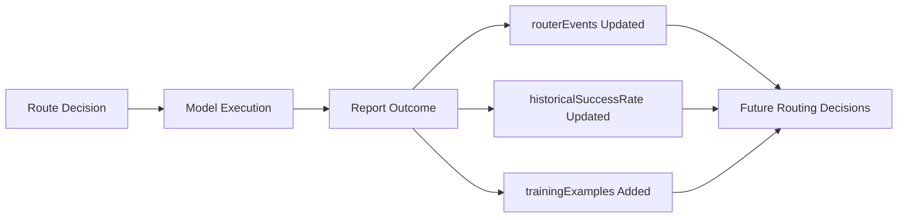

# Model Routing

Research set: [Overview](./README.md) | [Previous: Local-First](./04-local-first.md) | [Next: Experience Values](./06-experience-values.md)

**Thesis:** multi-model support becomes manageable when model choice is treated as a configurable routing problem with observable decisions.

Why this matters: a multi-model chat app quickly becomes difficult to reason about if every client branch contains provider-specific logic. This repository instead treats model choice as backend policy. Providers, models, profiles, routing rules, and routing outcomes all live in persisted backend state so the system can evolve without rewriting the clients every time the model landscape changes.

## Routing As A Funnel

The routing flow in `convex/modelSelection.ts` is heuristic, but it is not arbitrary. It converts request context into a routing decision through a series of explicit transformations.

## Data Model

The routing layer depends on several backend collections:

- `providers`: provider credentials, type, enablement, and provider-level configuration.
- `models`: user-facing model inventory and capability metadata.
- `modelSelectionProfiles`: routing-facing information such as pricing, latency, context window, tool reliability, benchmark scores, and success rate.
- `modelRoutingPolicies`: policy constraints such as minimum quality and fallback preferences.
- `routerEvents`: recorded routing decisions and later outcomes.

This means routing is part of the product model, not just a runtime helper.

## Decision Inputs

When the system routes automatically, it can consider inputs such as:

- request tier (`free`, `pro`, `advanced`)
- prompt text and estimated tokens
- inferred or explicit task type
- complexity score
- whether tools are required
- whether reasoning is required
- whether long context is needed
- cost and latency constraints

Some of these inputs are inferred heuristically. For example, task type can be inferred from prompt content, and complexity can be estimated from prompt size and capability requirements.

## Scoring Logic

`selectModel` computes a score from several parts:

- `qualityFit`: derived from benchmark scores and historical success rate
- `costFit`: derived from estimated cost against constraints
- `speedFit`: derived from latency against constraints
- `toolFit`: derived from tool support or reliability
- `contextFit`: derived from context window and long-context needs
- `riskPenalty`: subtractive factor for risk

Dynamic weights are then adjusted by complexity. Simpler tasks bias more toward cost and speed. More complex tasks bias more toward quality, context, and risk awareness.

This is an important systems decision. The router is not just filtering by "best model." It is selecting for a request profile.

## Fallback And Observability

The selected model is only part of the routing result. The system also records:

- fallback chain
- considered model set
- score breakdown
- estimated cost
- decision ID

This allows later outcome reporting. `reportOutcome` can record whether fallback was used, whether the result succeeded, and what the real usage/latency looked like. It can also feed updated success-rate signals back into model profiles and insert production routing examples into `trainingExamples`.

This feedback loop is still modest, but it matters. It means the router is built to observe and adapt rather than remain a write-only heuristic block.

## Why This Design Matters

The design buys three things:

- Clients can expose "Auto (router)" without embedding provider strategy in the UI.
- Admin-managed provider and model inventories can change without client redeploys.
- Routing becomes inspectable. A decision can be explained in terms of recorded scores and constraints.

That last point is especially relevant for research framing. A routing system is easier to discuss seriously when it stores its own decisions.

## Related Patterns / Influences

- Control-plane approaches to model selection and capability governance.
- Mixture-of-experts and router-style thinking, adapted here into a practical product backend rather than a learned serving graph.

## Tradeoffs and Limits

- The current router is heuristic and admin-informed, not a fully learned policy.
- Good routing depends on maintaining accurate profiles, latency data, and pricing metadata.
- Automatic task inference can misread ambiguous prompts.
- The standalone `services/router-agent` exists in the repo, but the primary routing story for this research set is the Convex-native selection path.

## Implementation Anchors

- Routing logic and outcomes: [`convex/modelSelection.ts`](../../convex/modelSelection.ts)
- Routing data model: [`convex/schema.ts`](../../convex/schema.ts)

## Open Questions / Next Directions

- When should the router move from heuristic weighting toward more learned or experimentally validated policies?
- How much routing explanation should be exposed directly in the UI?
- Should project context size and memory retrieval load become direct routing inputs as the system grows?
