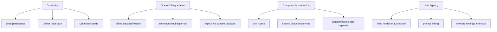

# Experience Values

Research set: [Overview](./README.md) | [Previous: Model Routing](./05-model-routing.md)

**Thesis:** the user experience of an AI chat app is shaped by system behavior as much as by visual design.

Why this matters: many AI products discuss UX only in terms of interface chrome. In a system like this one, the deeper UX question is whether the product behaves in a way the user can trust. Continuity, graceful degradation, composability, and bounded automation all depend on architecture, not only on styling.

## Principles And Mechanisms

This diagram is intentionally practical. Each value maps to a concrete mechanism already visible in the codebase.

## Principle Table

| Principle              | Mechanism in the repo                                                  | Why it matters                                                            |
| ---------------------- | ---------------------------------------------------------------------- | ------------------------------------------------------------------------- |
| Continuity             | local drafts, cached threads/messages, optimistic send state           | users should not feel that every network glitch destroys the conversation |
| Graceful degradation   | offline gating, inline error text, explicit empty-context responses    | failure should be legible and recoverable                                 |
| Composable interaction | `ChatPage` composition, thin route files, shared message rendering     | chat behavior stays consistent across new/existing thread routes          |
| User agency            | model selection, project attachment, memory management surfaces        | users can steer the system instead of accepting one hidden policy         |
| Bounded automation     | memory tools, routing logic, and policy addenda remain explicit layers | automation becomes inspectable rather than mysterious                     |

## Composition As UX Policy

The mobile chat structure is especially clear about this. Routes such as `app/(app)/chats.tsx` and `app/(app)/chat/[id].tsx` do not own the entire interface. They both compose `ChatPage`, which in turn composes `ChatHeader`, `MessageList`, `ChatComposer`, `OfflineBanner`, and `ModelPickerDialog`.

That is not just an engineering preference. It keeps the user experience coherent across chat entry points. A new chat and an existing chat do not become different products by accident. The same idea appears in the rule that model dialogs live under `apps/mobile/src/components/dialog` and message presentation stays shared through reusable chat components.

## Failure Handling As UX

Several backend and client decisions support a higher-trust experience:

- offline is surfaced as a real UI state, not disguised as model failure
- mobile optimistic sends can fail without erasing the user's prompt
- failed responses expose inline replay so users control when to retry
- prompt-context builders emit explicit empty-state text instead of pretending relevant context exists
- memory instructions tell the model that stored memory is advisory and the latest user message wins

These choices reduce a common AI UX failure mode: the system silently doing the wrong thing while still sounding confident.

## Routing And Memory As UX Features

Even though routing and memory are backend subsystems, they shape experience directly:

- "Auto (router)" is a UX affordance built on a routing control plane.
- Memory settings and memory tools shape how the app appears to remember and revise user facts.
- Project linking changes the relevance of responses by changing available context.

This is why a research account of UX cannot stop at components. The interface only makes sense when the backend behavior is stable enough to support it.

## Tradeoffs and Limits

- Explicit UX mechanisms are easier to trust, but they require more architecture than a thin client over one model API.
- Composable chat UI improves consistency, but can make highly custom route behavior harder to justify.
- User agency features add control, but they also increase the number of states the interface has to explain clearly.
- The current docs focus on system behavior, not on visual design quality, motion, or detailed interaction polish.

## Implementation Anchors

- Mobile chat composition: [`apps/mobile/src/components/chat`](../../apps/mobile/src/components/chat)
- Mobile dialog boundary: [`apps/mobile/src/components/dialog`](../../apps/mobile/src/components/dialog)
- Mobile send and conversation flow: [`apps/mobile/src/components/chat/use-chat-conversation.ts`](../../apps/mobile/src/components/chat/use-chat-conversation.ts), [`apps/mobile/src/mobile-data/use-send-message.ts`](../../apps/mobile/src/mobile-data/use-send-message.ts)
- Web send flow: [`apps/web/src/hooks/chat-data/send.ts`](../../apps/web/src/hooks/chat-data/send.ts)

## Open Questions / Next Directions

- Which UX states should be surfaced more explicitly, especially around routing and retrieved memory?
- How much system behavior should be shown inline versus kept implicit to preserve conversational flow?
- If the product adds richer collaboration features, how should these values extend beyond one user and one thread?
