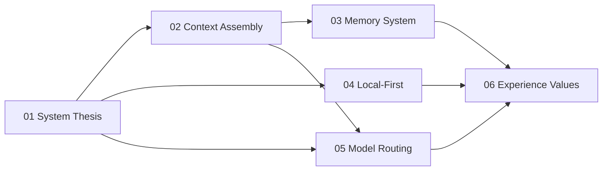

# Research Docs: Multi-Model Chat App

This folder presents the project as a research artifact rather than as contributor documentation. The goal is to explain how a multi-model chat app can combine durable memory, explicit context assembly, selective local-first behavior, and a high-trust user experience without collapsing everything into one opaque "AI layer." The writing stays grounded in the system that exists in this repository today, while calling out the tradeoffs and limits that shape it.

## System Thesis

- A useful chat app is not just a model wrapper; it is a stateful system that manages memory, context, routing, and failure as first-class design problems.
- Memory should be layered on top of conversation, not confused with the conversation itself.
- Multi-model behavior works better as an explicit routing/control-plane problem than as hardcoded provider branching in the UI.
- Local-first is most valuable when it preserves continuity and trust, even if different clients implement it at different strengths.
- Good AI UX depends on visible system behavior: composable UI, bounded fallbacks, and non-blocking error handling.

## Reader Guide

- Start here if you want the shortest explanation of the overall thesis and reading order.
- Read the chapters linearly if you want the full systems argument; each chapter links to the next.
- Use the conventional repo docs, especially [architecture.md](../architecture.md), if you need a more direct engineering map of the monorepo.

## Reading Order

1. [01-system-thesis.md](./01-system-thesis.md)  
   Defines the architectural stance of the app and the system boundaries.
2. [02-context-assembly.md](./02-context-assembly.md)  
   Explains how a message becomes a prompt with retrieved context instead of a raw model call.
3. [03-memory-system.md](./03-memory-system.md)  
   Describes the memory layer, its scopes, extraction path, and retrieval rules.
4. [04-local-first.md](./04-local-first.md)  
   Compares the mobile and web local-first strategies and explains why they are intentionally asymmetric.
5. [05-model-routing.md](./05-model-routing.md)  
   Shows how model choice becomes a configurable routing problem with feedback data.
6. [06-experience-values.md](./06-experience-values.md)  
   Connects the system architecture to user experience principles such as continuity and graceful degradation.

## How The Chapters Connect

## Tradeoffs and Limits

- This set is theory-first, so it does not enumerate every route, table, or component in the repo.
- The docs stay grounded in implemented behavior; they do not claim benchmarks or capabilities that are not visible in code.
- Several supporting systems exist in the repo, but only the parts that support the research thesis are treated as primary material here.

## Implementation Anchors

- Monorepo overview: [`README.md`](../../README.md)
- Conventional architecture map: [`docs/architecture.md`](../architecture.md)
- Core backend surface: [`convex/`](../../convex)
- Client applications: [`apps/mobile`](../../apps/mobile), [`apps/web`](../../apps/web)

## Open Questions / Next Directions

- How should this research set evolve if the web client adopts a stronger offline mutation model?
- At what point should the model-routing chapter include measured evaluation rather than architecture alone?
- Should project knowledge ingestion become its own research chapter if it becomes more central to prompt construction?
